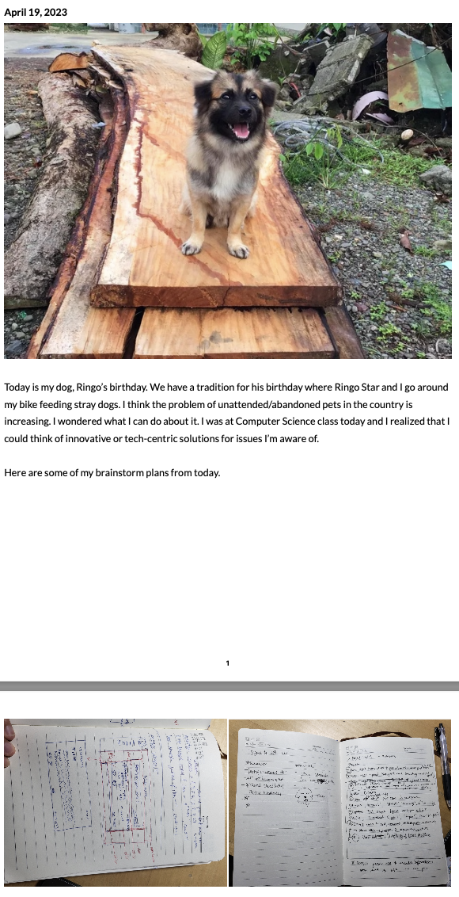
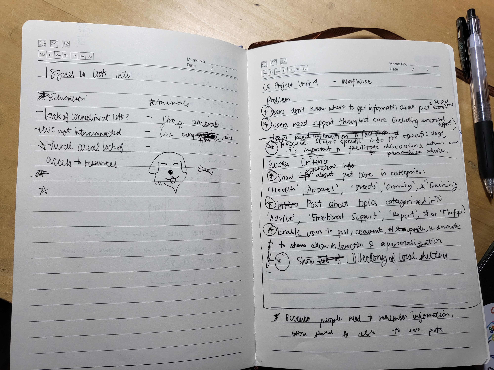
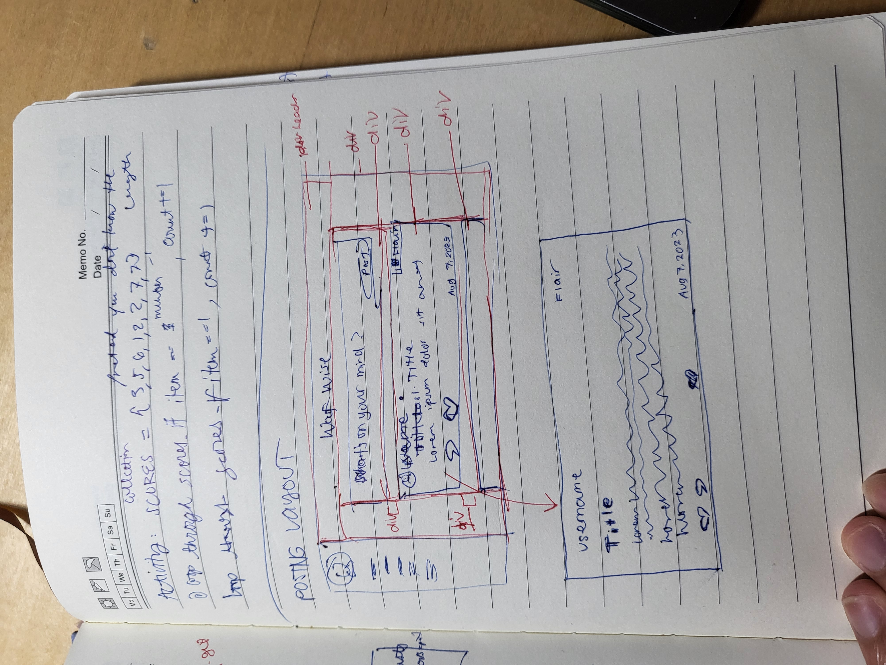
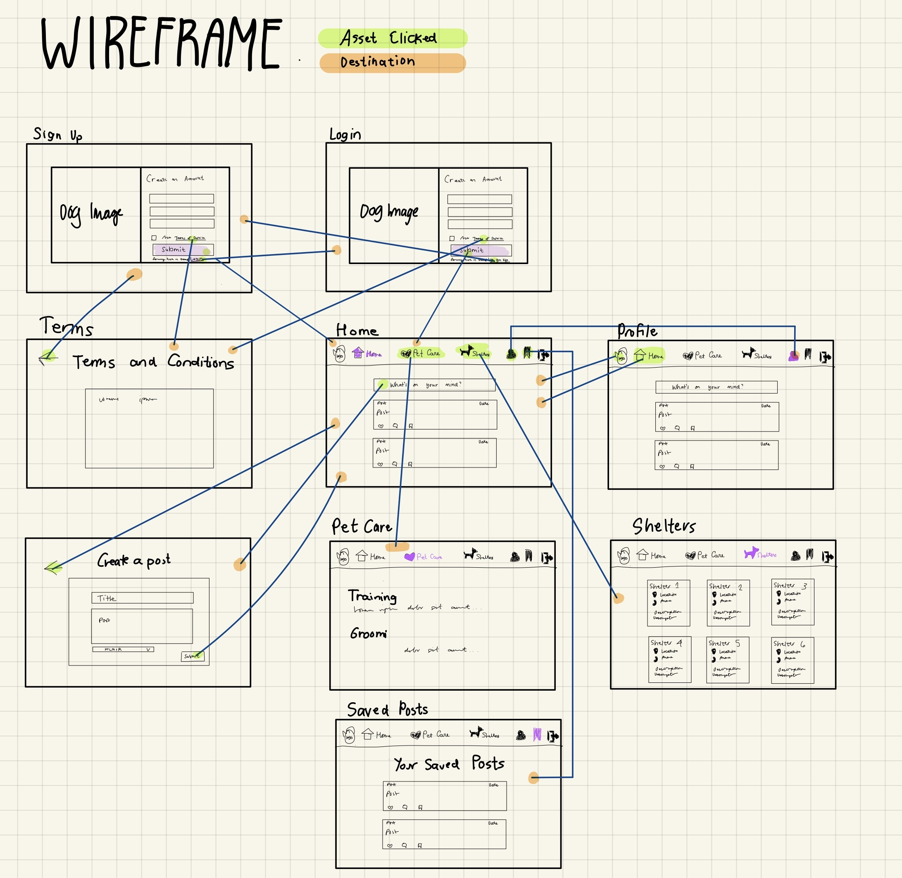
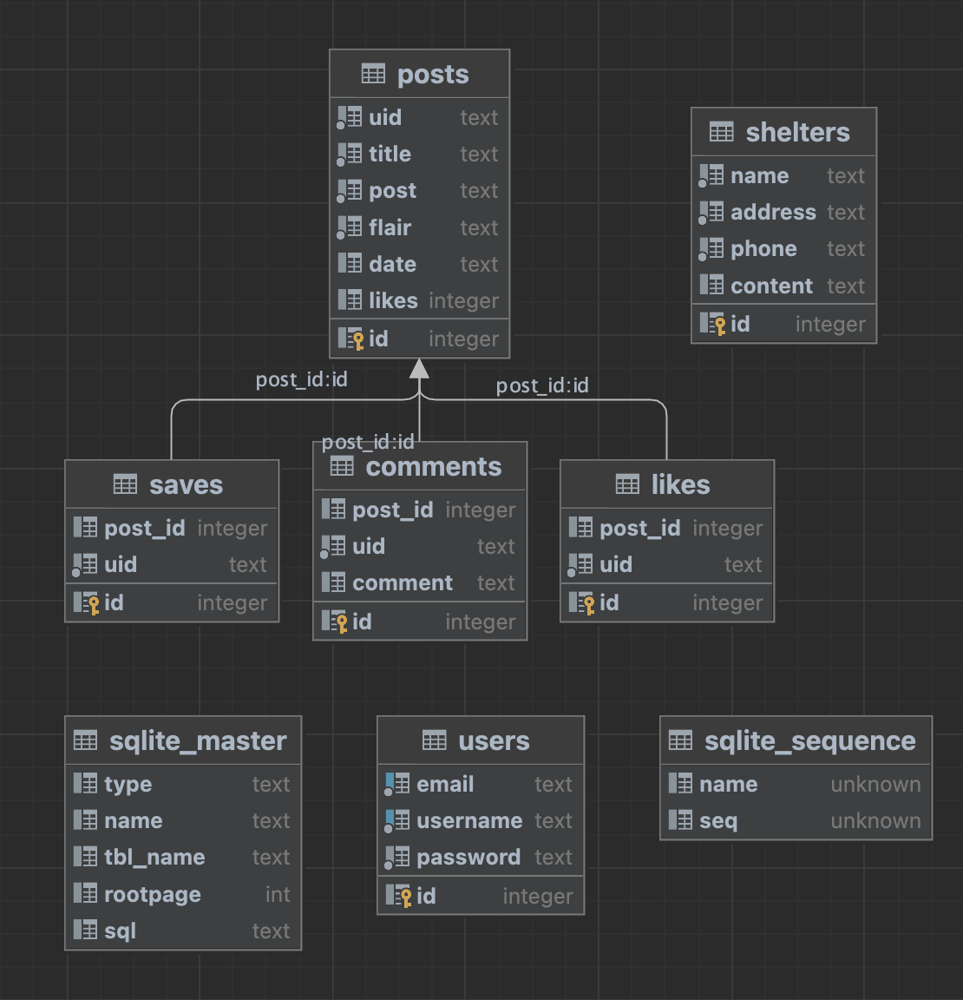
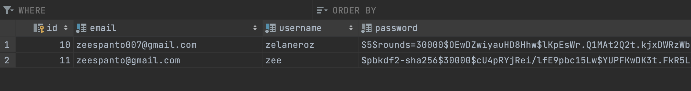
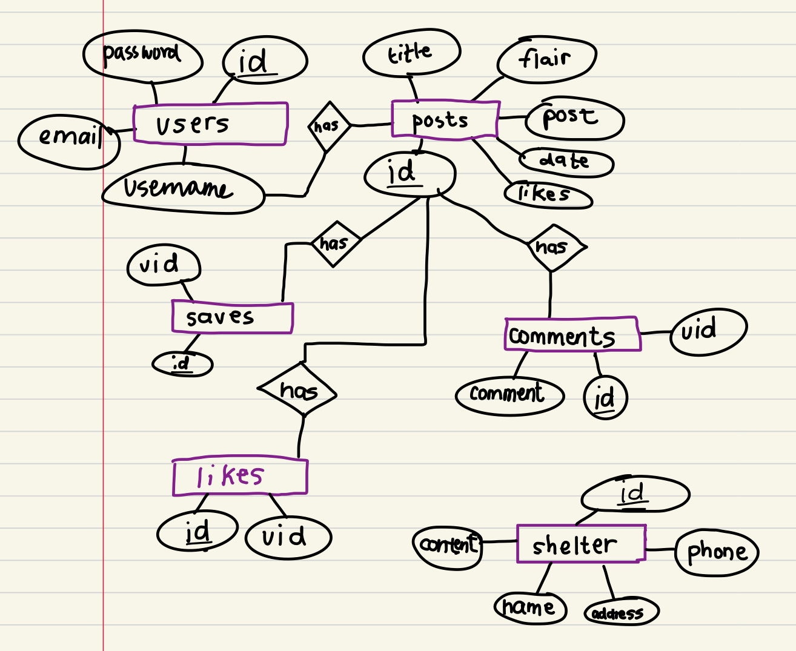

## COMMITTED

# Unit 4. Social Network: WoofWise

## Criteria A. Planning
### Problem Description 
I am a dog owner and is involved in many causes on pet care like The Philippine Animal Welfare Society (PAWS). Through reflection on my digital journal, I noticed that there is a significant issue with stray dogs in the Philippines and around the world, with many animals living in poor conditions and lacking access to proper care and attention. 

Unfortunately, many people who would like to adopt a dog and provide a loving home may not know where to start, or <a style="color: #c74e1a" id="prob3" href="#criteria">may not have access to information about available dogs and local shelters</a>. To add, in the case of pet owners, <a id="prob2" style="color:#eb349b" href="#criteria">although there are multiple sites about pet care, the information for these sites are not coherent and organized</a>. It’s important to also note that <a id='prob1' style="color:orange" href="#criteria">the measures of taking care of pets is different for every dog type and owner, thus there is a need for personalization by allowing users to post about a subject and by allowing interactions with other users with similar experiences or pet breed</a>. In addition to this personalization scheme, <a id="prob4" style="color: #6817a6" href="#criteria">as users may only want to remember certain posts that they might find information for their situation or their pet’s breed, the users should be able to save certain posts that they find significant.</a>

### Rationale for Proposed Solution
As the provided problem focuses on lack of access to information,the proposed solution is a web application. Compared to other alternative solutions such as a mobile application,  a web application enables many users to access the same version of app, to not require app installation, and for users to access the software on various platforms like desktop or mobile. 

The proposed solution is a web application that allows users to post questions/statements, acquire general information on pet care, access a directory of shelters, and save posts that they may resonate/relate to (as pet care varies due to factors like breed, age, and condition).The app is necessary for people who want to make informed decisions regarding their pets, get support from a network of fellow/interested pet owners, and help stray or unadopted animals, as stated in the problem description. 

Python and Flask will be used to develop the web application, along with the three main programming languages commonly used to build a web application, HTML, CSS, and JavaScript. It is optimal to use Python for the development of the application since it's platform independent,that is, one can develop in one operating system and does not have to worry of incompatibility on other operating systems[^9]. Flask will be used for the web app because it is a lightweight framework that can handle multiple requests concurrently, allowing efficiency and fast response times for the users' end. HTML is provides the structure and content of web pages, allowing users to easily navigate and understand the information presented. CSS allows for aesthetic,  making it visually appealing and engaging for users, thus enhancing the overall user experience.  Lastly, SQLite is self-contained relational database management  which will be used due to its simplicity, reliability, and portability allowing for the program and the database to both be localized.

### Design Statement
I will develop a social networking platform in the form of a web application built with Flask, HTML, CSS, Python, and SQLite as the database management engine. This web application will allow both pet owners and potential pet owners to post information or questions about pet care. The web app will include the following features: save post, like/dislike, comment, and sort through posts. It will take about 3 weeks to a month to complete the development of the project and will be evaluated according to a certain success criteria set.   

### <a id="criteria"></a>Criteria for Success 
1. <a style="color:orange" href="#prob1">The web application is a social network where users are able to post about topics and categorize them into “Advice”, “Emotional Support”, “Report”, and “Fluff”</a> 
2. <a style="color: orange" href="#prob1"> The solution should enable users to post, comment on posts, and like posts.</a> 
3. <a style="color:#eb349b" href="#prob2">The solution is a web application and it should show general information about pet care into certain categories: “Health”, “Breeds”, “Grooming”, and “Training”.</a>
4. <a style="color: #c74e1a" href="#prob3">The web app should show a directory of pet shelters. This directory involves the shelter’s name, address, telephone number, email, and contact person.</a>
5. <a style="color: #6817a6" href="#prob4">The web application enables users to bookmark posts and have these bookmarks saved in one page.</a>
6. <a href="#prob2" style="color:#eb349b">The web app allows users to view posts according to the flair(category) the post is in.</a>

**Evidence**

*Figure 1. Image of diary entry and pages during brainstorming*


*Figure 2. Page on journal during project brainstorming process*


*Figure 3. Page on journal during project brainstorming process*


## Criteria B. Design
### Record of Task
| Task No | Planned Action                                                                                                                                                                                             | Planned Outcome                                                                                                                                                                                                                                                                                                                                                                                                                                                                  | Time estimate | Target completion date | Criterion | 
|---------|------------------------------------------------------------------------------------------------------------------------------------------------------------------------------------------------------------|----------------------------------------------------------------------------------------------------------------------------------------------------------------------------------------------------------------------------------------------------------------------------------------------------------------------------------------------------------------------------------------------------------------------------------------------------------------------------------|------------|------------------------|-----------|
| 1       | Write the context of the problem                                                                                                                                                                           | Establish the problem identified in a clear and concise manner. The problem definition must include a detailed description of the problem scenario, what the client wants, existing solutions considered, and indicate a possible solution.                                                                                                                                                                                                                                      | 15 min     | April 17, 2023         | A         |
| 2       | Brainstorm and write a proposed solution for the problem.                                                                                                                                                  | Explain in a concise and clear manner the purpose of the project.                                                                                                                                                                                                                                                                                                                                                                                                                | 5 min      | April 17, 2023         | A         |
| 3       | Write the success criteria of the proposed solution.                                                                                                                                                       | A clear set standards to be met by the developer, that suits the client's needs and preferences.                                                                                                                                                                                                                                                                                                                                                                                 | 15 min     | April 17, 2023         | A         |
| 4       | Confirm or revise success criteria.                                                                                                                                                                        | Confirmed success criteria and ensure it meets the client's standards.                                                                                                                                                                                                                                                                                                                                                                                                           | 15 min     | April 17, 2023         | A         |
| 5       | Write a design statement for the proposed solution 'Woof Wise'                                                                                                                                             | A coherent design statement that outlines the plan for the project.                                                                                                                                                                                                                                                                                                                                                                                                              | 20 min     | April 19, 2023         | A         |
| 6       | Draw a system diagram for the proposed web app solution                                                                                                                                                    | Have a concrete idea of the software and hardware requirements involved in the development of the application                                                                                                                                                                                                                                                                                                                                                                    | 15 min     | April 20, 2023         | B         |
| 7       | Design web app logo on Canva.                                                                                                                                                                              | A png file of the web app's logo is created.                                                                                                                                                                                                                                                                                                                                                                                                                                     | 20 min     | April 20, 2023         | C         |
| 8       | Plan & create the wireframe for the proposed solution                                                                                                                                                      | Have a detailed visual representation of the project which also serves as a guide for the developer during the programming process. the planned wireframe must align with the client's success criteria.                                                                                                                                                                                                                                                                         | 90 min     | April 20, 2023         | B         |
| 9       | Develop the database_handler class.                                                                                                                                                                        | A ```database_handler``` class is developed in a python filed entitled ```my_lib.py``` which enables the developer to use SQLite with Python efficiently.  It connects to a database called ```woof.db``` and includes the following methods: ```search```, ```run_save```, and ```close```.                                                                                                                                                                                     | 10 min     | April 20, 2023         | C         |
| 10      | Front-end: Develop the Login page WUI for the web app 'Woof Wise' based on the planned Wireframe using HTML & CSS.                                                                                         | A page containing text fields which allows the user to input log in credentials.                                                                                                                                                                                                                                                                                                                                                                                                 | 40 min     | April 22, 2023         | C         |
| 11      | Back-end: Map the Login page html file to a specific function in ```app.py``` that handles the login logic & specifications for the URL.                                                                   | A secure program & page allowing the user to login to the web app using an existing username or email and password.                                                                                                                                                                                                                                                                                                                                                              | 50 min     | April 22, 2023         | C         |
| 12      | Develop password encryption in ```my_lib.py```.                                                                                                                                                            | A python file containing the encrypt_password class which take's a user's password and encrypt it using sha256 before being strored in the SQLite database ```woof.db```.                                                                                                                                                                                                                                                                                                        | 10 min     | April 22, 2023         | C         |
| 13      | Front-end: Develop the Registration or Sign Up page WUI using HTML & CSS.                                                                                                                                  | An HTML page that allows the user to register a new account. In this step however, the screen is still limited given that it's still merely a GUI, with no methods connected to its graphic components whatsoever.                                                                                                                                                                                                                                                               | 20 min     | April 22, 2023         | C         |
| 14      | Back-end: Map the Sign Up page html file to a specific function in ```app.py``` that handles the registration logic & specifications for the URL.                                                          | Have a web page that allows the user to register a new account (username, email, and password) and save these data into the 'users' table of an SQLite database titled 'woof.db'                                                                                                                                                                                                                                                                                                 | 30 min     | April 22, 2023         | C         |
| 15      | WUI: Develop a WUI for a post created in the web app. This will be contained in a div tag.                                                                                                                 | Observes aesthetic and allows for personalized data to be included such as username of post's created, date posted, post content, post flair, like button, save button, and reply button.                                                                                                                                                                                                                                                                                        | 50 min     | April 23, 2023         | C         |
| 16      | Front-end: Develop the Home page WUI using HTML & CSS.                                                                                                                                                     | The home page contains a navigation bar that contains a log out button and allows navigation between the Home, Profile, Shelters, Pet Care Info, and Saved Posts pages. It also contains a visual/WUI template for each posts created on the web app.                                                                                                                                                                                                                            | 90 min     | April 24, 2023         | C         |
| 17      | Back-end: Map the Home page html file to a specific function and route in ```app.py``` that accesses the posts contained in the ```posts``` table of ```woof.db``` and passes these posts to the homepage. | Integration of front-end and back-end part of the Home page allows the user to see the posts created and stored in the database in a visual manner.                                                                                                                                                                                                                                                                                                                              | 50 min     | April 24, 2023         | C         |
| 18      | Front-end: Develop the 'Create post' page WUI using HTML & CSS.                                                                                                                                            | A page containing text fields which allows the user to input post title, content (with a maximum length of 30 and 280 characters respectively), and flair.                                                                                                                                                                                                                                                                                                                       | 20 min     | April 24, 2023         | C         |
| 19      | Back-end: Map the 'Create post' page html to a function and route in ```app.py```.                                                                                                                         | Actually allows the user to create a post, save this to a table called ```posts``` in the ```woof.db``` database, and update the homepage by adding the newly created post to the stream of existing posts.                                                                                                                                                                                                                                                                      | 30 min     | April 24, 2023         | C         |
| 20      | Front-end: Develop the Profile page WUI using HTML & CSS, and allow personalization using Jinja 2.                                                                                                         | A page that contains a template for posts created and greets the user. It also contains a button that asks the user if they would like to create a new post.                                                                                                                                                                                                                                                                                                                     | 30 min     | April 26, 2023         | C         |
| 21      | Back-end: Map the Profile page html to a function and route in ```app.py```. Observe the use of cookies to allow for personalization to the specific logged in user.                                       | The profile page now also contains all the posts created by the user.                                                                                                                                                                                                                                                                                                                                                                                                            | 50 min     | April 26, 2023         | C         |
| 22      | Develop the like feature which enables a user to like and unlike a post on the profile or home page.                                                                                                       | A ```likes``` table is created in the ```woof.db``` database which contains the id, post_id of the post liked, the username of the liker, and the like count. When like button is clicked, the code in the ```updates()``` function in ```app.py``` checks whether the user has liked the post before. If so, it is 'unliked' and deletes a row in the likes table in the database. If not, it updates the likes table and also updates the like count on the front-end of the page. | 60 min     | May 1, 2023            | C         |
| 23      | Develop the save feature which enables a user to save a post.                                                                                                                                              | A ```saves``` table is created in ```woof.db``` database which contains the id, post_id and username. When the user navigates to the **Saved posts** page, only the posts saved by the user are reflected on the said page.                                                                                                                                                                                                                                                      | 20 min     | May 1, 2023            | C         |
| 24      | Develop the commment feature by creating an html file specific to the post where the user intends to reply to, and developing the syntax in the ```updates``` function of ```app.py```.                    | A ```comments``` table is created ```woof.db``` database which contains the id, post_id, username, and commment. When a user cliks on the reply button, it leads to a page specific to that posts where users can leave a reply (maximum length of 200).                                                                                                                                                                                                                         | 40 min     | May 1, 2023            | C         |
| 25      | Develop the 'Shelters' webpage, edit navigation bar references, and map the html to a url or app route in ```app.py```.                                                                                    | A page that contains cards of listed shelters, containing the shelter's name, phone number, address, and services information.                                                                                                                                                                                                                                                                                                                                                   | 90 min     | May 3, 2023            | C         |
| 26      | Develop the 'Pet care' webpage, edit dummy references in existing navigation bars, and map the html to a url or app route in ```app.py```.                                                                 | A page that contains organized content of information of pet care organized into certain categories: “Health”, “Breeds”, “Grooming”, and “Training”.                                                                                                                                                                                                                                                                                                                             | 90 min     | May 4, 2023            | C         |
| 27      | Write the test plan.                                                                                                                                                                                       | Have a clear idea of factors and components of the app to look into, and see whether these are up to standard.                                                                                                                                                                                                                                                                                                                                                                   | 40 min     | May 5, 2023            | B         |
| 28      | Beta Testing                                                                                                                                                                                               | Gauge the app's functionality, security, and visual layout by testing the app. Take note of bugs and concerns, and forumlate app amendments.                                                                                                                                                                                                                                                                                                                                     | 15 min     | May 6, 2023            | C         |
| 29      | Beta Development                                                                                                                                                                                           | Code changes into the web app based on feedback.                                                                                                                                                                                                                                                                                                                                                                                                                                 | 150 min    | May 7, 2023            | C         |
| 30      | Rewrite the test plan.	                                                                                                                                                                                    | Update the test plan with the new components developed after client's feedback.	                                                                                                                                                                                                                                                                                                                                                                                                 | 30 min	    | May 8, 2023	           | B         |
| 31      | Testing (using revised test plan)	                                                                                                                                                                         | Use the test plan. By this point, it is expected for every component stated to be up to standard.	                                                                                                                                                                                                                                                                                                                                                                               | 30 min	    | May 8, 2023            | C         | 
| 32	     | Create flow diagrams of chunks of the code on app.py and write brief explanataions for each.	                                                                                                              | Have accurate and comprehensive representations of how parts of the program/code works with brief explanations.                                                                                                                                                                                                                                                                                                                                                                  | 	40 min	   | May 8, 2023            | B         | 
| 33      | Write & finish Criteria C.	                                                                                                                                                                                | Write about the techniques and resources used in the code, and how these came to be.                                                                                                                                                                                                                                                                                                                                                                                             | 	80 min    | May 9, 2032	           | 	A        | 
| 34	     | Go through and revise the project's documentation.	                                                                                                                                                        | Ensure that the documentation is accurate, comperehensible for the client, and follows proper citations.                                                                                                                                                                                                                                                                                                                                                                         | 40 min     | May 9, 2023 	          | A         |
| 35      | Finish video for Criteria D.                                                                                                                                                                               | 	A video evidence of all the success criterias functioning and working within the developed application.	                                                                                                                                                                                                                                                                                                                                                                        | 30 min     | May 10, 2023	          | 	D        | 
| 36      | Criteria E.                                                                                                                                                                                                | Evaluate project through its success criteria. Look for a peer to review the web application and take note of evaluations & recommendations done.                                                                                                                                                                                                                                                                                                                                | 30 min     | May 10, 2023           | E         |

### Internal Structure (Diagrams)
#### System Diagram ---- (TO BE CHECKED BY DR. RUBEN)
#### Wireframes

*Figure 4. Wireframe of the Woof Wise web app*
#### UML Diagram ---- TBD!!!!
*Figure 5. UML Diagram of the Woof Wise web app*
#### Database

*Figure 6. Diagram of data tables used for the Woof Wise web app*
#### Sample Data Entries

*Figure 7. Sample data entries in the users table of the database*
#### ER Diagram

*Figure 8. Entity Relation Diagram of the Woof Wise web app*
#### Flowcharts ---- TBD!!!!
**Registration System**
*Figure 9. Flowchart of the Woof Wise web app registration algorithm*
**Like/Dislike**
*Figure 10. Flowchart of the Woof Wise web app like/dislike algorithm*
**Add post**
*Figure 11. Flowchart of the Woof Wise web app post creation algorithm*


### Test Table 
| Test No | Test Type                                                                                          | Date   | Procedure                                                                                                                                                                                                                                                                                                                                                                                                                                                                                                                                                                                                                                                                                                                                                                                                              | Expected Outcome                                                                                                                                                                                                                                                                                              |
|---------|----------------------------------------------------------------------------------------------------|--------|------------------------------------------------------------------------------------------------------------------------------------------------------------------------------------------------------------------------------------------------------------------------------------------------------------------------------------------------------------------------------------------------------------------------------------------------------------------------------------------------------------------------------------------------------------------------------------------------------------------------------------------------------------------------------------------------------------------------------------------------------------------------------------------------------------------------|---------------------------------------------------------------------------------------------------------------------------------------------------------------------------------------------------------------------------------------------------------------------------------------------------------------| 
| 1       | Functional: Test  whether the SignUp page succesfully registers new user if all entries are valid. | Apr 23 | Run python file (app.py). Go to sign up page and enter the following values: <br/>- email: bob@isak<br/>- username: bob<br/>-password: bob123456                                                                                                                                                                                                                                                                                                                                                                                                                                                                                                                                                                                                                                                                       | When the database, woof.db is checked, a new row of data can be seen. This row shows the entered email, username, and password encrypted using a certain hash.                                                                                                                                                |  
| 2       | Functional: Test sign up screen when data inputted by user is invalid                              | Apr 23 | Run app.py. Navigate to the SignUp page. Enter the following values:<br/>-  email: bob@isak<br/>- username: bob2<br/>-password: bob123456                                                                                                                                                                                                                                                                                                                                                                                                                                                                                                                                                                                                                                                                              | Once the sign up button is clicked and the user input is queried into the database, the application shows a dialog box that tells the user the exact error. In this case, since the email already exists due to the prior test step, the dialog will show "Email already exists. Please try again".           |
| 3       | Functional: Data registered from a new user is stored securely in an SQLite Database.              | Apr 23 | After Test step 1 and 2, open the sqlite database console and view the users table.                                                                                                                                                                                                                                                                                                                                                                                                                                                                                                                                                                                                                                                                                                                                    | The users table must have the email, username, and a hashed password.                                                                                                                                                                                                                                         |
| 4       | Functional: Test Sign up page with invalid input (empty fields)                                    | Apr 23 | username(''), email(''), pass1('bob'), pass2('12345')                                                                                                                                                                                                                                                                                                                                                                                                                                                                                                                                                                                                                                                                                                                                                                  | Feedback should be given to the user through a dialog stating the error ("Please input required fields").                                                                                                                                                                                                     |
| 5       | Functional: Test Sign up page with invalid input (existing username)                               | Apr 23 | username('bob'), email('bob4@isak'), pass1('bob'), pass2('12345')                                                                                                                                                                                                                                                                                                                                                                                                                                                                                                                                                                                                                                                                                                                                                      | Feedback should be given to the user through a dialog stating the error ("Username already exists. Please try again").                                                                                                                                                                                        |
| 6       | Functional: Test Sign up page with invalid input (mismatched passwords)                            | Apr 23 | Input: username('bob4'), email('bob4@isak'), pass1('bob'), pass2('12345')                                                                                                                                                                                                                                                                                                                                                                                                                                                                                                                                                                                                                                                                                                                                              | Feedback is given to the user by having the password text fields red.                                                                                                                                                                                                                                         |
| 7       | Functional: Test Sign up page with invalid input (existing email).                                 | Apr 23 | Input: username('bob4'), email('bob@isak'), pass1('bob'), pass2('12345')                                                                                                                                                                                                                                                                                                                                                                                                                                                                                                                                                                                                                                                                                                                                               | Feedback should be given to the user through a dialog stating the error ("Email already exists. Please try again").                                                                                                                                                                                           |
| 8       | Functional: Test Login page with valid input.                                                      | Apr 26 | Input the username and password registered during test step 1.                                                                                                                                                                                                                                                                                                                                                                                                                                                                                                                                                                                                                                                                                                                                                         | Once the login button is clicked, the app transitions to the Main Screen                                                                                                                                                                                                                                      |
| 9       | Functional: Test login page with invalid input (username that hasn't been registered prior).       | Apr 26 | Input a random username and password that haven't been registered to the application prior.                                                                                                                                                                                                                                                                                                                                                                                                                                                                                                                                                                                                                                                                                                                            | The application shows a dialog box stating that the 'User does not exist'.                                                                                                                                                                                                                                    |
| 10      | Functional: Test login page with invalid input (existing username but wrong password)              | Apr 26 | Input a previously registered username ('bob') or email ('bob@isak') and input a wrong or random password ('12345').                                                                                                                                                                                                                                                                                                                                                                                                                                                                                                                                                                                                                                                                                                   | The appplication's password textfield turns red.                                                                                                                                                                                                                                                              |
| 11      | Functional: Add Post (added to the database and the home feed)                                     | Apr 30 | On the home page, click on the add post button that says 'What do you think?'. It leads to a page containing a form for a user to create a new post. The input fields include Flair, Title, and Post.                                                                                                                                                                                                                                                                                                                                                                                                                                                                                                                                                                                                                  | Once new valid entry input is done and the user clicks submit, the database is updated. The user is automatically redirected to the home screen where they can see the post they created appear.                                                                                                              |
| 12      | Functional: Validate when trying to post                                                           | Apr 30 | On the home page, click on the add post button that says 'What do you think?'. It leads to a page containing a form for a user to create a new post. All input fields are required to be filled out by the user. The title field has a maximum length of 100 characters while the post or content field has a maximum length of 300 characters. Test invalid inputs by submitting a post (a)withot choosing a flair (b) without a title (c) with a title exceeding 100 characters (d) without a content (e) a content exceeding 280 characters.                                                                                                                                                                                                                                                                        | Once submitted, the screen will stay on the create post page until a user inputs valid entries for all text fields.                                                                                                                                                                                           |
| 13      | Functional: View by Flair button                                                                   | May 2  | On the home page, there is a button above the stream of posts that allows the user to view the posts by flair: 'Advice', 'Emotional Support', 'Report', or 'Fluff'. Click on 'Advice'                                                                                                                                                                                                                                                                                                                                                                                                                                                                                                                                                                                                                                  | The home page shows only posts that correspond to the selected category. For example, if 'Advice' is clicked, only the entries under the Advice category are shown.                                                                                                                                           |
| 14      | Functional: Like & Unlike                                                                          | May 2  | On the home page, click an unliked post to like. And then click it again (unlike).                                                                                                                                                                                                                                                                                                                                                                                                                                                                                                                                                                                                                                                                                                                                     | Every post card has a corresponding like count beside the like button. When like button is clicked, the like count goes up. When the user clicks this again, the like count goes down. This shows that the user is limited to only liking a post once.                                                        |
| 15      | Functional: Comment                                                                                | May 4  | On the home page, click on the comment button of a certain post. When led to a new page, enter comment.                                                                                                                                                                                                                                                                                                                                                                                                                                                                                                                                                                                                                                                                                                                | Once comment button is clicked, the user is led to a new page which contains only the post the user wants to comment on. This page contains an entry field in which a user can input their thoughts. Once 'Reply' is clicked, this new comment is updated and shown in a stream of comments of the same page. |
| 16      | Functional: Save + Saved posts are shown in the saved posts page.                                  | May 4  | On the home page click on the save button of a certain post.                                                                                                                                                                                                                                                                                                                                                                                                                                                                                                                                                                                                                                                                                                                                                           | Once the save button is clicked, the post id of the post saved is added to a table called 'save' in the ```woof.db``` database. As the user moves to the 'saved posts' page, the user is able to see all the posts they saved.                                                                                |
| 18      | Functional: Profile page shows posts created by the user currently logged in                       | May 4  | On the home page, click on the 'Profile' button found in the navigation bar.                                                                                                                                                                                                                                                                                                                                                                                                                                                                                                                                                                                                                                                                                                                                           | Button leads the user into the profile page where all the posts created by the user are shown.                                                                                                                                                                                                                |
| 19      | Functional: Pet Care Page                                                                          | May 6  | On the home page, click on the 'Pet Care' button found in the navigation bar.                                                                                                                                                                                                                                                                                                                                                                                                                                                                                                                                                                                                                                                                                                                                          | Button leads the user into the pet care page where information about pet care are organized into different categories. This fulfills success criteria #3.                                                                                                                                                     |
| 20      | Functional: Shelter Page                                                                           | May 6  | On the main screen, click the Log out icon button.                                                                                                                                                                                                                                                                                                                                                                                                                                                                                                                                                                                                                                                                                                                                                                     | Button leads the user into the shelters directory where cards containing pet shelters' information (Name, Description, Address, Phone Number) are presented to the user.                                                                                                                                      |
| 21      | Functional: Logout                                                                                 | May 6  | On the main screen, click the Log out icon button.                                                                                                                                                                                                                                                                                                                                                                                                                                                                                                                                                                                                                                                                                                                                                                     | A pop up shows asking the user if they want to log out. When yes is clicked, the popup closes and the user returns to the Log in Screen. If No is clicked, the pop up closes and the user stays on the Main Screen.                                                                                           |
| 22      | Integration Testing (All screens)                                                                  | May 7  | Since at this point, all components and screens have been tested individually, we test the integration of each screen. Start with testing the Main Screen and try out all the functionalities in the Main Screen (Adding, Editing, Deleting, Sorted View, and then Logout). Once the Main Screen is tested, move down to the Log in Screen and test the previous test steps involving the Log in Screen (Invalid username, invalid password, invalid email, empty fields, wrong password, and then a valid input respectively.) Once the Log in Screen is tested, move down to the Registration Screen and test the previous test steps involving the Registration Screen (existing username, existig email, password less than 8 characters, empty fields, unmatched passwords, and then a valid input respectively.) | All pages work together. The user is able to do all functionalities in each screen and move from one screen to another with ease.                                                                                                                                                                             |
| 23      | Non-functional: Code Clarity Review.                                                               | May 7  | Review if the code has adequate & direct comments, function names, and variable names. Ask another person with adequate computer science knowledge to look through the code.                                                                                                                                                                                                                                                                                                                                                                                                                                                                                                                                                                                                                                           | A fellow developer  is able to comprehend what each variable, file, and functions are for.                                                                                                                                                                                                                    |


## Criteria C. Development 
**Software Development Tools**
* PyCharm
* Python
* SQLite
* Flask
* Jinja2
* HTML
* CSS
* ChatGPT

**Libraries/Modules**
Flask
* Flask
* request
* render_template
* redirect
* url_for
* make_response

Python
* time
* datetime
* sqlite3
* CryptContext

**Techniques Applied**
* Flask App Routing
* Cookies
* GET and POST methods
* Functions
* if, elif, and else statements
* variables
* for loops
* Password Encryption: Passlib CryptContext
* Database interaction
* Text Formatting
* CSS styling


### Explanation of Techniques and Evidence
### Ingenuity
### Complexity

[^1]: SQLite Home Page. https://www.sqlite.org/index.html. Accessed 14 Apr. 2023. 

[^2]: SQLAlchemy - The Database Toolkit for Python. https://www.sqlalchemy.org/. Accessed 14 Apr. 2023.

[^3]: “Welcome to Python.Org.” Python.Org, 13 Apr. 2023, https://www.python.org/.

[^4]: Welcome to Flask — Flask Documentation (2.1.x). https://flask.palletsprojects.com/en/2.1.x/. Accessed 14 Apr. 2023.

[^5]: Structuring the Web with HTML - Learn Web Development | MDN. 23 Feb. 2023, https://developer.mozilla.org/en-US/docs/Learn/HTML.

[^6]: Learn to Style HTML Using CSS - Learn Web Development | MDN. 23 Feb. 2023, https://developer.mozilla.org/en-US/docs/Learn/CSS.

[^7]: JavaScript | MDN. 5 Apr. 2023, https://developer.mozilla.org/en-US/docs/Web/JavaScript.

[^8]: Jinja — Jinja Documentation (3.1.x). https://jinja.palletsprojects.com/en/3.1.x/. Accessed 14 Apr. 2023.

[^9]: Python Geeks. Advantages of Python | Disadvantages of Python. 25 June 2021, https://pythongeeks.org/advantages-disadvantages-of-python/.

## Criteria D. Functionality & Extensibility
### Functionality
### Extensibility

## Criteria E. Evaluation
### Evaluation
#### Client Evaluation
| Success Criteria | Status   | Description |
|------------------|----------|-------------|
| /                | Achieved |             |

#### Peer Evaluation

### Recommendations